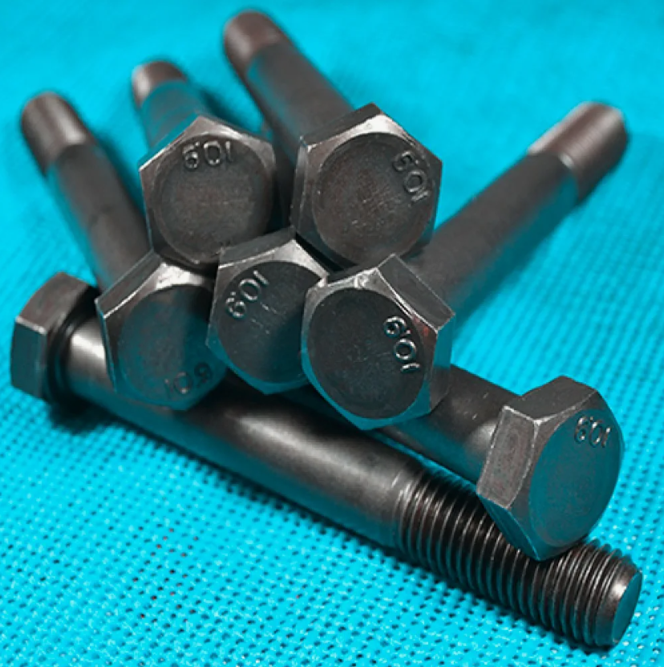
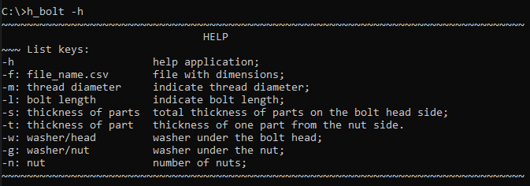
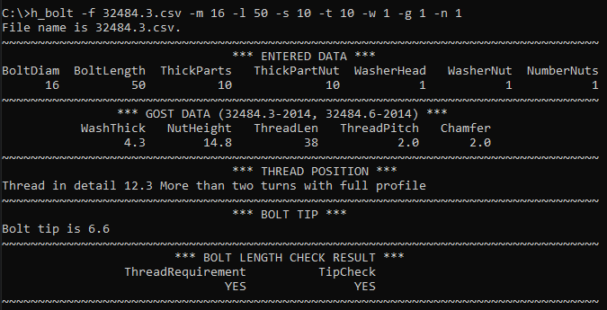
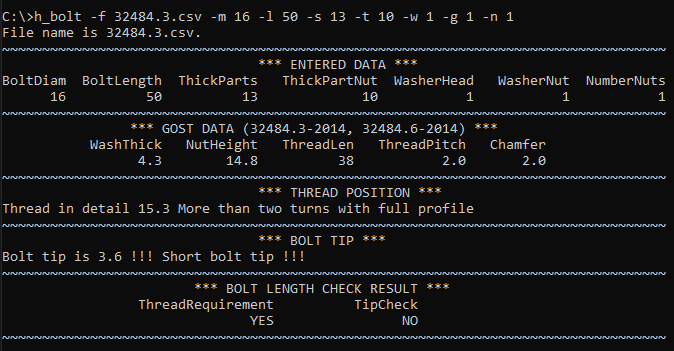
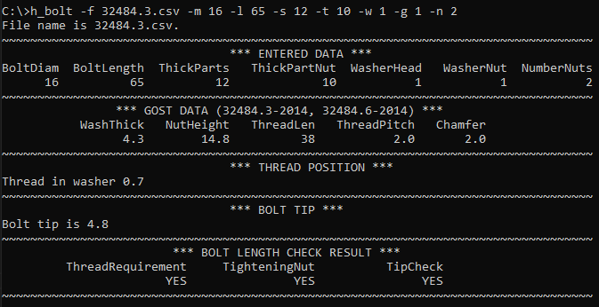
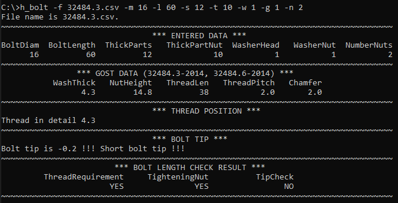
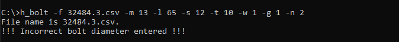
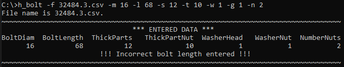
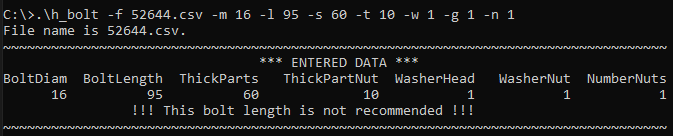

## Многомодульная программа
### Консольное приложение "Проверка длины болта в соединениях с контролируемым натяжением"

#### Цель разработки:

Устранение появления возможных ошибок при работе с болтовыми соединениями в программе Tekla Structures и ручном подборе длины болта. 

#### Описание возможной ошибки: 

При копировании болтов "в другой объект", в случае изменения толщин соединяемых деталей, Tekla Structures программно не меняет длину болта в сторону уменьшения или увеличения. Формально болт продолжает соединять детали, но имеет некорректную длину. Игнорирование проверки длины болта приведёт к тому, что болтовое соединение не будет соответствовать требованиям нормативных документов.

#### Приложение позволяет проверить длину болта, с установкой 1-ой гайки, по следующим параметрам:

* под гайкой имеется не менее двух витков резьбы с полным профилем*;
* над гайкой резьба имеет не менее одного витка*.

#### Приложение позволяет проверить длину болта, с установкой 2-х гаек, по следующим параметрам:

* расположении резьбы болта на глубине не более 0,5t в ближней к гайке детали**;
* возможность закручивания гайки (резьба болта не выходит из шайбы);
* размер выхода резьбового конца болта из гаек***.

#### Приложение имеет справку:

#### Приложение обрабатывает следующие аргументы командной строки:

* -h Описание функционала приложения;
* -f <filename.csv> Указание входного файла *.csv для обработки.
* -m Указание диаметра болта;
* -l Указание длины болта;
* -s Указание суммарной толщины соединяемых деталей за исключением толщины ближней к гайке детали;
* -t Указание толщины ближней к гайке детали;
* -w Указание количества шайб под головкой болта;
* -g Указание количества шайб под гайками;
* -n Указание количества гаек.

#### Сборка приложения осуществляется при помощи утилиты make.

#### Файл для тестирования работы приложения:

* 32484.3.csv

Болт по ГОСТ 32484.3-2014, гайка по ГОСТ 32484.3-2014, шайба по ГОСТ 32484.6-2014

* 52644.csv 

Болт по ГОСТ 52644-2006, шайба по ГОСТ 52646-2006, гайка по ГОСТ 52645-2006

#### Варианты возможного комплектования болтового соединения:

а) болтовое соединение с контролируемым натяжением с одной гайкой 

* головка болта - одна шайба - соединяемый пакет - одна шайба - одна гайка;
* головка болта - нет шайбы - соединяемый пакет - одна шайба - одна гайка.

б) болтовое соединение без контролируемого натяжения с двумя гайками 

* головка болта - нет шайбы - соединяемый пакет - одна шайба - две гайки;
* головка болта - нет шайбы - соединяемый пакет - две шайбы - две гайки;
* головка болта - одна шайба - соединяемый пакет - одна шайба - две гайки;
* головка болта - одна шайба - соединяемый пакет - две шайбы - две гайки;

#### Примеры работы приложения:

a) болтовое соединение с контролируемым натяжением с одной гайкой

* длина болта удовлетворяет всем перечисленным требованиям

* над гайкой недостаточно резьбы

б) болтовое соединение без контролируемого натяжения с двумя гайками

* длина болта удовлетворяет всем перечисленным требованиям

* над гайкой недостаточно резьбы

#### Реализована проверка параметров, введенных пользователем:

* контроль диаметра болта

* контроль длины болта по ГОСТ 7798-70

* контроль нерекомендованных к применению длин болтов

#### Примеры написания командной строки для запуска:

h_bolt

h_bolt -h

h_bolt -f 52644.csv -m 16 -l 65 -s 16 -t 10 -w 1 -g 1 -n 1

h_bolt -f 32484.3.csv -m 16 -l 60 -s 13 -t 10 -w 1 -g 1 -n 1

#### Состав репозитория:
<url> &#128194; high_bolt_check </url> - файлы проекта

<url> &#128194; images </url> - файлы *.png для README.md

~~~

*п. 7.4.14

**п. 14.2.5 СП 16.13330.2017, п. 4.5.4 СП 70.13330.2012

***п. 4.5.7 СП 70.13330.2012 

~~~

(<a href="#readme-top">вверх</a>)

